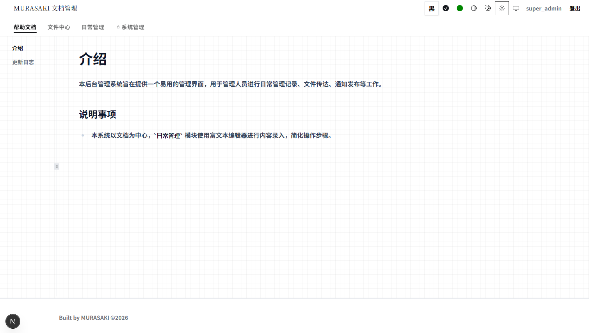
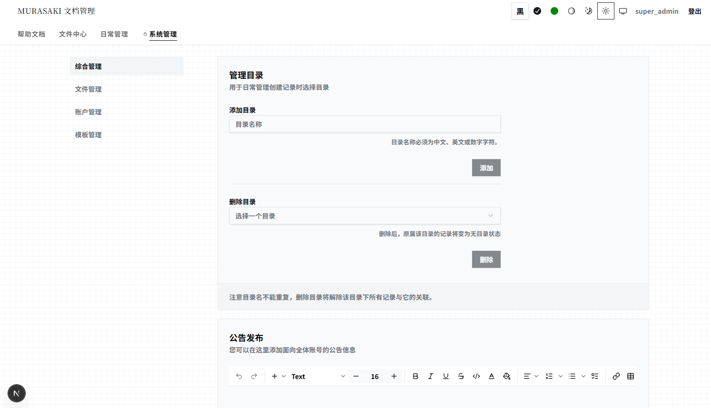

# MURASAKI Docs

A Simple Document management system — Next.js + Prisma + SQLite + Tailwind CSS + shadcn/ui




## Quick Start

```bash
pnpm install
pnpm prisma generate
pnpm prisma migrate dev
SEED_DEVELOPMENT=true pnpm seed
pnpm dev
```

Visit http://localhost:3000, login: `super_admin` / `super_admin`

## Docker

```bash
cp .env.example .env   # edit SESSION_SECRET, etc.
docker compose up -d --build
```

Container startup ([docker-entrypoint.sh](scripts/docker-entrypoint.sh)):

1. `prisma migrate deploy` — auto-create/update database tables
2. If `SEED_DEVELOPMENT=true` — seed demo data
3. `node server.js` — start Next.js production server

Visit http://localhost:3000, login: `super_admin` / `super_admin`

Data persisted via volumes: `./database`, `./data/files`, `./data/template`

---

## Developer Guide

| Command | Description |
|---------|-------------|
| `pnpm dev` | Start dev server |
| `pnpm build` | Production build |
| `pnpm start` | Production server |
| `pnpm lint` | Run ESLint |
| `pnpm seed` | Seed demo data |

### Release

```bash
pnpm release:patch && git push origin main --tags   # 0.1.0 → 0.1.1
pnpm release:minor && git push origin main --tags   # 0.1.0 → 0.2.0
pnpm release:major && git push origin main --tags   # 0.1.0 → 1.0.0
```

Pushing `v*` tag triggers GitHub Actions to publish Docker image to `ghcr.io`.

```bash
docker compose --profile ghcr up -d app-ghcr   # use published image
```
